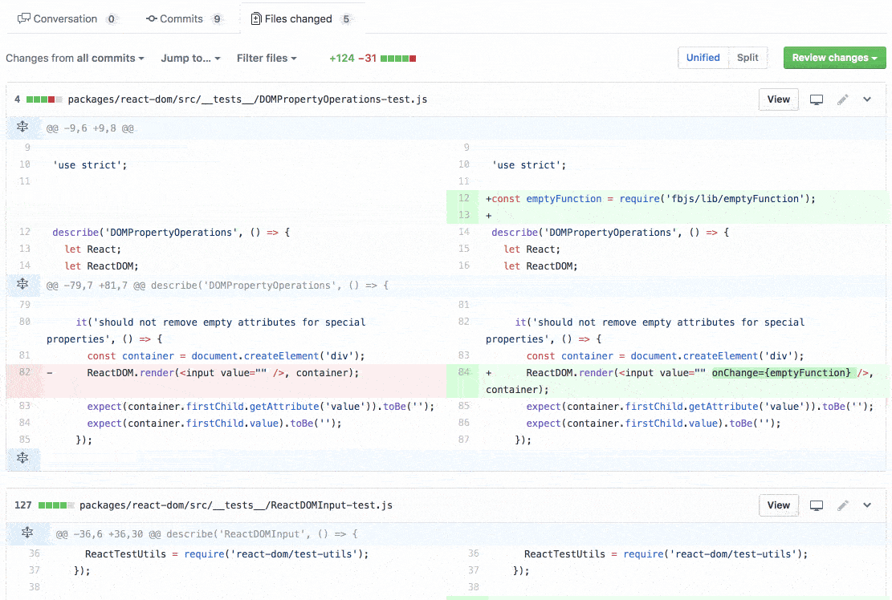
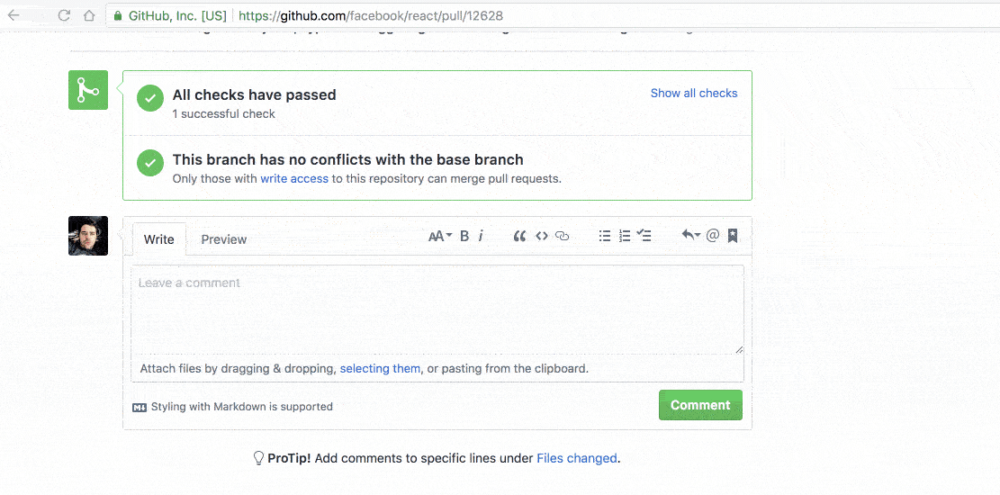

# GitHub Review Filter - Chrome Extension

Speed up how you review PRs filtering files based on glob pattern.

## Features

Split your code review into parts based on:

- Components (eg: `**/components/Header/**`)
- Without tests (eg: `!**/__tests__/**`)
- File types (eg: `*.js`)
- No jest snapshot (eg: `!*.snapshot`)
- etc...

Also, share the filters using links.

## Preview

#### Filter files in PR review

#### Share filters using links

## Credits
Inspered by [siggysamson's project](https://github.com/siggysamson/pr-file-filter-for-github)
