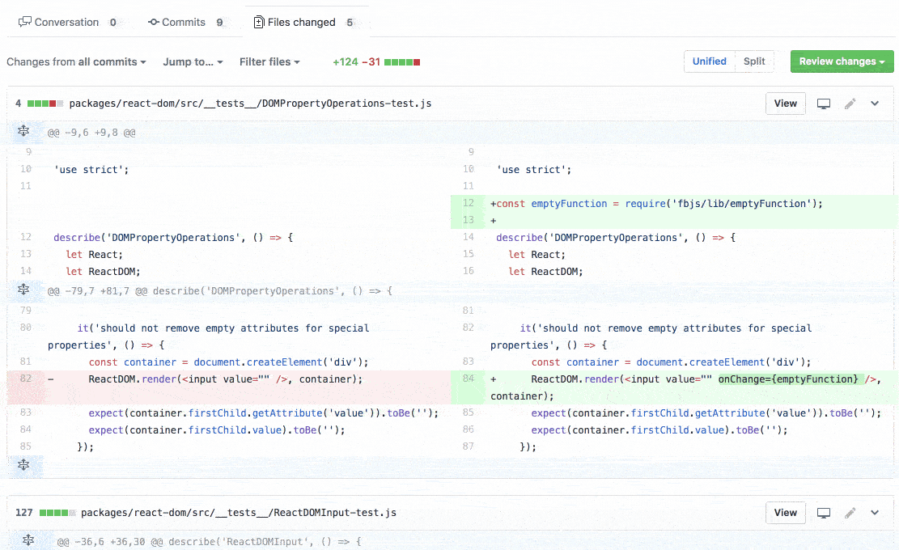

# GitHub Review Filter - Chrome Extension

Speed up how you review PRs filtering files based on glob pattern.

You can split your code review into parts based on:

- Components (eg: `**/components/Header/**`)
- Without tests (eg: `!**/__tests__/**`)
- File types (eg: `*.js`)
- No jest snapshot (eg: `!*.snapshot`)
- etc...

### Filter files in PR review

### Share filters using links

